# sv-yae: A Streaming BF16 Self-Attention Accelerator on FPGA

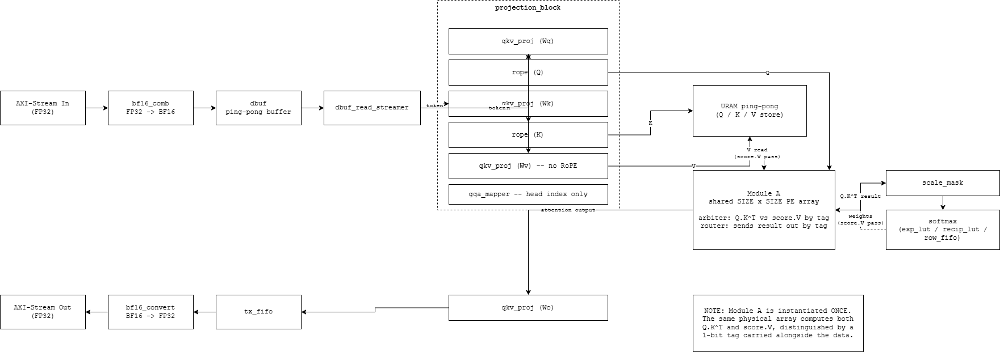

**Team:** İTÜ Yonga (Yonga Attention Engine, YAE)

- Belinay Güler
- Can Ertürk
- Hasan Sancak
- M. Taha Aydemir

**Date:** August 2026 | **Platform:** Xilinx Vivado / SystemVerilog

## Introduction

Four billion years ago there was no such thing as paying attention. Chemistry happened uniformly, everywhere, all at once, until self replicating molecules gave some of that chemistry a reason to prefer one direction over another. A few billion years later, nervous systems appeared, and with them a genuinely new capability, not just reacting to the world, but selecting which part of it to react to. A frog's eye does not report everything in front of it with equal weight. It reports the fly. Attention, in the biological sense, is one of evolution's oldest tricks for making a small brain behave as if it were a much larger one, by deciding, moment to moment, what is worth thinking about at all.

Strip away the neurons and the same problem shows up in a much younger kind of system. A transformer language model reading a sentence faces something close to what a frog faces looking at a pond. Every word in the input could, in principle, matter to every other word, but treating all of them as equally relevant would be both computationally wasteful and semantically wrong. Self-attention is the mechanism that lets the model decide, for each word, which of the other words actually deserve its attention, and by how much. It does this with a surprisingly small amount of arithmetic: three vectors per token, a similarity score between every pair of tokens, and a weighted sum. That is essentially the whole idea. The depth, the parameter counts, the emergent behavior people find remarkable, all of it is this same simple operation repeated at scale.

This project takes that operation and asks a narrower, more concrete question than "how well does it work." It asks what self-attention looks like when it is not a function call inside a Python library running on a GPU, but a physical arrangement of logic gates on a piece of silicon, computing one clock edge at a time, with a fixed and finite amount of hardware. sv-yae is the İTÜ Yonga team's answer. It is a SystemVerilog RTL implementation of the self-attention block used in LLaMA-style transformer models, built to run on a real FPGA rather than to simulate the idea of running on one. Every stage of the pipeline (projection, positional encoding, similarity, softmax, output) is its own dedicated hardware module. Data moves between them as a continuous BF16 stream over AXI-Stream-style valid/ready handshakes, and the single most expensive piece of hardware, the multiply-accumulate array, is time-shared between two different matrix multiplications instead of being built twice.

Key highlights:

- **Streaming BF16 datapath:** every value on the internal bus is 16 bits of bfloat16 plus a 1-bit source tag, moving one element per clock, no big parallel buses.
- **RoPE (Rotary Positional Encoding):** Q and K vectors are rotated by a position-dependent angle pulled from a ROM, using the standard base-10000 frequency formula.
- **GQA (Grouped Query Attention):** multiple query heads share a single key/value head, cutting KV storage without cutting query resolution.
- **Time-shared systolic array:** the same SIZE×SIZE PE array computes both Q·Kᵀ and score·V, arbitrated by a tag bit instead of built twice.
- **Valid/ready everywhere:** every module boundary in the design, from the AXI-Stream front end down to a single multiply-accumulate step, uses the same handshake discipline.
- **Ping-pong double buffering:** new tokens load into one buffer while the previous one is still being processed.
- **Zero DSP-block dependency where it matters:** the BF16 adder/multiplier are built from plain logic, not vendor macros, so the design stays portable.

## Navigation

- [Introduction](#introduction)
- [Why It Matters](#why-it-matters)
- [What is Self-Attention?](#what-is-self-attention)
- [Mathematical Background](#mathematical-background)
- [Architecture](#architecture)
- [Algorithm Explanations](#algorithm-explanations)
- [Integration](#integration)
- [Performance Analysis](#performance-analysis)
- [Directory Structure](#directory-structure)
- [Modules](#modules)
- [Simulation](#simulation)
- [Physical Interpretation](#physical-interpretation)
- [Real-World Applications](#real-world-applications)
- [Known Limitations / What's Next](#known-limitations--whats-next)
- [References](#references)

---

## Why It Matters

Transformer inference is dominated by attention, and attention is dominated by two big matrix multiplications (Q·Kᵀ and score·V) plus a row-wise softmax in between. On a CPU or GPU, this is a well-optimized library call. On the edge, at low power, or as a fixed accelerator block feeding a larger SoC, it has to be built from scratch in gates.

| | Software (CPU/GPU library) | This project (FPGA) |
|---|---|---|
| Execution model | Kernel calls into optimized BLAS/cuBLAS | Dedicated hardware pipeline, one stage per operation |
| Latency character | Throughput-oriented, batches amortize overhead | Deterministic, streaming, one token in flight at a time |
| Precision | FP16/FP32/INT8 depending on runtime | Fixed BF16 throughout, chosen once at design time |
| Resource reuse | Implicit, managed by the runtime scheduler | Explicit: one systolic array does both Q·Kᵀ and score·V, arbitrated by a tag bit |
| Power/area envelope | General-purpose silicon, always-on overhead | Only the instantiated logic exists. Nothing else is paid for |
| Where it wins | Large batch, data-center inference | Small, fixed-shape, always-on, or power/area constrained inference |

The point is not that hardware beats a GPU on raw throughput. It does not, not at this scale. The point is that a purpose-built accelerator can do attention with no runtime, no scheduler, and no more logic than the four stages actually require.

## What is Self-Attention?

Self-attention answers one question for every token in a sequence: *which other tokens should I pay attention to, and how much?*

Every token is projected into three vectors: a **Query** (what am I looking for), a **Key** (what do I offer), and a **Value** (what do I actually contribute). A token's attention score against another token is the dot product of its Query with that token's Key. Those scores are scaled, optionally masked (so a token can't look at future tokens), and turned into a probability distribution with softmax. The final output for a token is the weighted sum of every Value vector, weighted by those probabilities.

$$
\text{Attention}(Q, K, V) = \text{softmax}\left(\frac{QK^T}{\sqrt{d_k}} + \text{mask}\right)V
$$

This project implements exactly that formula as a hardware pipeline, plus two refinements used by modern LLMs: **RoPE** (so the model knows token *order* without adding position vectors to the embeddings) and **GQA** (so multiple query heads can share one key/value head, cutting the KV cache size).

## Mathematical Background

**Scaled dot-product attention.** For a query matrix $Q$, key matrix $K$, and value matrix $V$, each row being one token:

$$
\text{scores} = \frac{QK^T}{\sqrt{d_k}}
$$

$$
\text{weights} = \text{softmax}(\text{scores}) \quad \text{(row-wise, with an optional causal mask)}
$$

$$
\text{output} = \text{weights} \cdot V
$$

**RoPE.** For a vector pair $(x_1, x_2)$ at position $\text{pos}$, rotated by angle $\theta$:

$$
y_1 = x_1\cos\theta - x_2\sin\theta
$$

$$
y_2 = x_1\sin\theta + x_2\cos\theta
$$

$$
\theta(\text{pos}, i) = \text{pos} \cdot \text{base}^{-2i/d_{\text{model}}}, \qquad \text{base} = 10000
$$

This project pairs element $i$ with element $i + D_{\text{MODEL}}/2$ (the "rotate-half" convention used by LLaMA), rather than with its immediate neighbor.

**GQA.** With $N_Q$ query heads and $N_{KV}$ key/value heads ($N_Q$ divisible by $N_{KV}$), query head $q$ reads from key/value head:

$$
\text{kv}_{\text{head}}(q) = \left\lfloor \frac{q}{N_Q / N_{KV}} \right\rfloor
$$

No data is duplicated or moved. Only the read address changes.

**BF16 format.** Every value on the internal bus is:

$$
\{\ \text{sign}_{[1]},\ \ \text{exponent}_{[8]},\ \ \text{mantissa}_{[7]}\ \}
$$

the same exponent range as FP32 truncated to 8 mantissa bits. On top of the 16-bit value, this design carries one extra tag bit (bit 16) through the shared arithmetic units, identifying which logical stream produced the value. This is what lets one physical PE array serve two different matrix multiplications without mixing up their operands.

## Architecture

The diagram at the top of this README is the complete data path, read left to right. A token enters as FP32 over AXI-Stream, gets truncated to BF16 by `bf16_comb`, and lands in the ping-pong `dbuf`. `dbuf_read_streamer` feeds `projection_block`, which pushes the token through three parallel weight matrices, Wq, Wk, and Wv. The Q and K paths each continue through their own `rope` instance for positional rotation. V skips RoPE entirely, since a value vector carries no position-dependent meaning of its own. All three vectors land in the ping-pong URAM.

Module A, the shared systolic array in the middle of the diagram, then runs twice on the same physical hardware. First it computes Q·Kᵀ from the URAM contents. Then, once `scale_mask` and `softmax` have turned that similarity matrix into normalized weights, it runs a second time to compute score·V, using the exact same PEs. The 1-bit tag carried on every value is what lets Module A's input arbiter and output router send each of the two passes to the right place without ever needing a second copy of the array. The result is projected once more through `qkv_proj` (this instance loaded with Wo), streamed through `tx_fifo`, converted back to FP32, and returned over AXI-Stream.

`architecture.drawio` (open with the draw.io / diagrams.net extension) has five pages: the system-level data flow above, plus one FSM diagram each for `qkv_proj`, `rope`, `softmax`, and the `uram_pingpong_controller` read side, derived directly from the actual `case`/`always_comb` state logic in those files rather than hand-drawn from memory. The same five pages are rendered to PNG under `images/diagram_*.png`.

<details>
<summary>Auto-generated architecture diagram</summary>

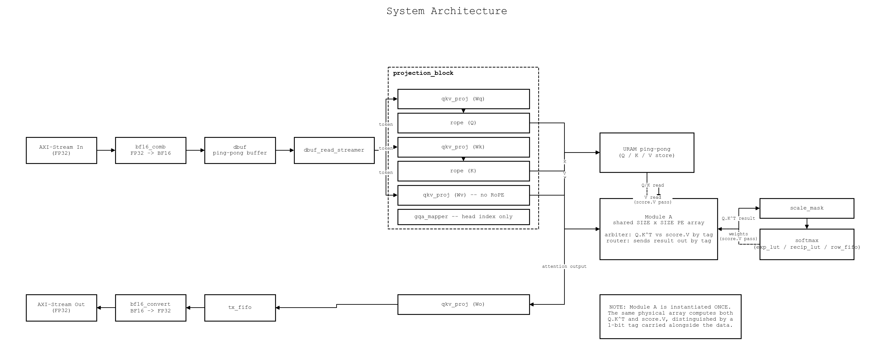

*The same data path as the hand-touched diagram at the top of this README. Kept here so the underlying structure stays visible and checkable against the polished version above.*

</details>

<details>
<summary>Per-module FSM diagrams</summary>

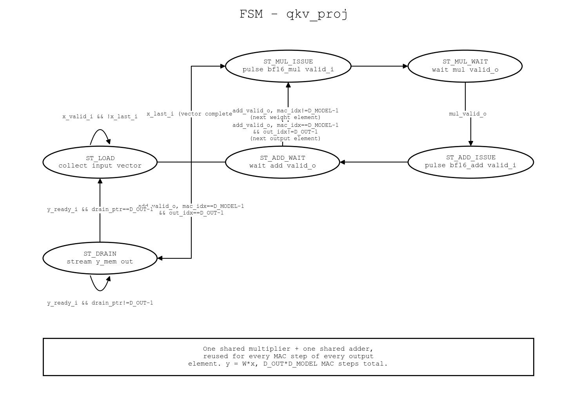

*Six states covering one full $y = Wx$ projection. `ST_LOAD` collects the input vector one element per cycle, then for every output element the FSM steps through an issue/wait pair for the shared multiplier and another for the shared adder, looping `D_OUT × D_MODEL` times before `ST_DRAIN` streams the finished vector back out.*

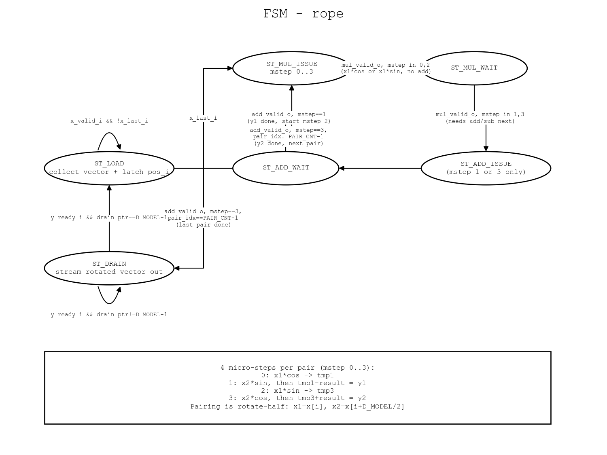

*The same six-state shape as `qkv_proj`, but each pair of elements needs four micro-steps (`mstep` 0 to 3) instead of one, since a single rotation costs two multiplies, a subtract, and an add, all sharing that same one multiplier and one adder.*

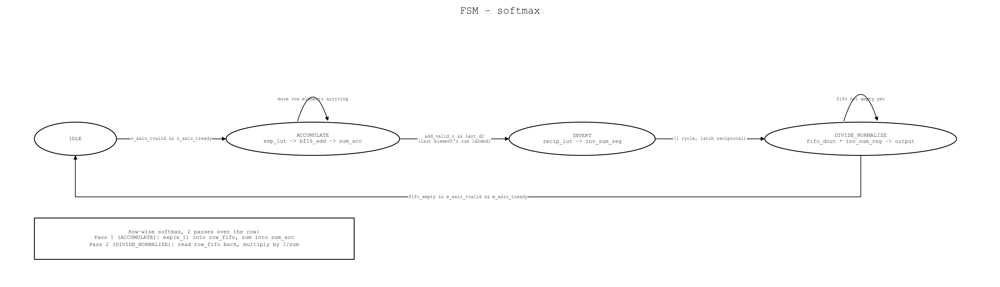

*Four states, two passes over one row. `ACCUMULATE` builds the row's exponential sum through `exp_lut`, `INVERT` turns that sum into a reciprocal in a single cycle through `recip_lut`, and `DIVIDE_NORMALIZE` streams the row back out of `row_fifo`, each element multiplied by that reciprocal.*

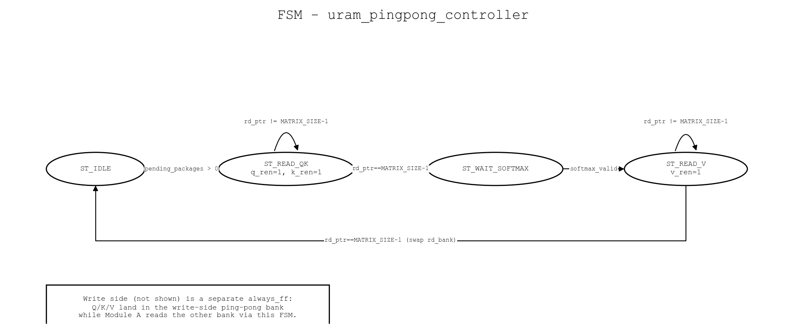

*The read side only, the write side is a separate always block not shown here. `ST_READ_QK` and `ST_READ_V` stream one full depth slice into Module A each, `ST_WAIT_SOFTMAX` pauses in between until softmax's result comes back, and the read bank swaps once a full pass through both slices finishes.*

</details>

```
AXI-Stream in (FP32) → bf16_comb → dbuf (ping-pong) → dbuf_read_streamer
                                                              │
                                          token vector, one element/cycle
                                                              ▼
                                                    projection_block
                                       ┌───────────┬───────────┬───────────┐
                                       │  qkv_proj │  qkv_proj │  qkv_proj │  (Wq / Wk / Wv)
                                       │   + rope  │   + rope  │  (no rope)│
                                       │    (Q)    │    (K)    │    (V)    │
                                       └─────┬─────┴─────┬─────┴─────┬─────┘
                                             Q            K            V
                                             │            └──────┬─────┘
                                             │                   ▼
                                             │            URAM ping-pong (Q/K/V store)
                                             │                   │
                                             ▼                   ▼
                                    ┌───────────────────────────────────────┐
                                    │   Module A: shared SIZE×SIZE PE array │
                                    │   (input arbiter picks Q·Kᵀ vs         │
                                    │    score·V by tag, output router      │
                                    │    sends the result back out by tag)  │
                                    └───────────────────┬────────────────────┘
                                                         │
                                     Q·Kᵀ result ────────┤
                                                         ▼
                                          scale_mask → softmax (exp/recip LUTs)
                                                         │
                                     softmax weights ────┘ (fed back into Module A for score·V)
                                                         │
                                                         ▼
                                          qkv_proj (Wo) → tx_fifo → bf16_convert
                                                         │
                                                         ▼
                                                AXI-Stream out (FP32)
```

Module A is instantiated **once**. The same physical array computes Q·Kᵀ on one pass and score·V on the next, distinguishing the two data streams with a 1-bit tag carried alongside every value. This is the single biggest resource-saving decision in the design.

## Algorithm Explanations

**QKV Projection (`qkv_proj.sv`).** A single parameterized matrix-vector multiply module, instantiated four times (Wq, Wk, Wv, Wo) with a different weight matrix loaded into each. Implemented as a simple state machine reusing one multiplier and one adder per instance rather than a parallel array. Correctness first, a wider design can follow once the team confirms it is needed.

**RoPE (`rope.sv`).** Rotates Q and K (never V) using sine/cosine values pulled from a ROM addressed by `(position, pair index)`. Because there's no dedicated subtractor yet, the "minus" in the rotation formula is done by flipping the sign bit of the second operand before feeding the shared adder.

**GQA Mapper (`gqa_mapper.sv`).** Purely combinational index translation. Given the current query head, it returns which key/value head that query head should read from. It never touches vector data itself.

**Shared Q·Kᵀ / score·V array (`qk_array.sv`, `qk_pe.sv`, wrapped by `mod_a_wrapper.sv`).** A `SIZE×SIZE` output-stationary systolic array. Query/key elements stream in serially along the depth dimension. Once a full depth slice has been accumulated, the array switches to a parallel read-out phase. An input arbiter (`mod_a_input_arbiter.sv`) gives priority to score·V requests arriving from softmax, then accepts new Q·Kᵀ tiles. This keeps the softmax-to-output path from stalling behind newly arriving queries. An output router (`mod_a_output_router.sv`) sends the result back to softmax or to the output projection depending on the same tag bit.

**Scale, Mask & Softmax (`scale_mask.sv`, `softmax.sv`, `exp_lut.sv`, `recip_lut.sv`, `row_fifo.sv`).** Raw similarity scores are scaled and (per-element) masked to $-\infty$ in a 3-stage backpressure pipeline, then normalized by a 4-state softmax FSM (accumulate → invert → normalize) that trades throughput for numerical accuracy: exponentials and reciprocals both come from small LUTs rather than an iterative approximation.

**Memory & Data Routing (`dbuf.sv`, `dbuf_read_streamer.sv`, `uram_memory.sv`, `uram_pingpong_controller.sv`, `tx_fifo.sv`, `axi_stream_if.sv`).** `dbuf` lets a new token vector load while the previous one is still being processed. Q/K/V are held in ping-pong URAM banks so Module A can read one bank while the next token's projections write the other. `tx_fifo` and `axi_stream_if` carry finished output vectors back out over AXI-Stream, doing the BF16 to FP32 conversion at the boundary.

## Integration

None of the four members' RTL lived in the same place before this stage. `fpt-Can`, `FPT_belinay_codes`, `FPT_hasan`, and `FPT_taha` were four independent branches, each written and tested against assumptions about the others' interfaces that had never been checked against real code. Merging them into the single `rtl/` tree in this repository, led by **Can Ertürk**, surfaced a list of concrete mismatches that no amount of reading the code side by side would have caught. Only actually trying to elaborate the whole design in Vivado did.

A few examples pulled directly from that process:

- `uram_memory.sv` generated its own write address internally, while `uram_pingpong_controller.sv` computed a ping-pong bank address expecting to drive that memory directly. The port it needed did not exist. Added.
- `mod_a_wrapper.sv` computed an `m_last` signal internally but never exposed it as a port, so the final element of every attention tile was invisible outside the module. Added the port.
- `axi_stream_if.sv` declared its `m_axis_tdata` output as 16 bits instead of 32. This alone was serious enough that Vivado's synthesizer could prove the whole output path carried no real information and quietly deleted almost the entire design during synthesis, from roughly 1,500 real LUTs down to 73. Fixing one port width restored the whole pipeline.
- `en_scale_mask` was wired to a constant 1 in `top.sv`. By `scale_mask.sv`'s own logic, that masks every element of every row to negative infinity, so softmax would have degenerated to a fixed output regardless of input. Changed the default to 0 (no masking) until real per-position causal mask logic exists.
- `qkv_proj.sv`, `rope.sv`, and the shared `qk_array.sv` systolic array all made separate, undocumented assumptions about the 1-bit tag riding along the top of the 17-bit BF16 bus. Getting the Q·Kᵀ pass and the score·V pass to agree on whose tag was whose took a specific, still-flagged fix inside `mod_a_input_arbiter.sv`.

Once the pipeline actually elaborated and simulated, Can Ertürk also built the standalone testbench suite under `tb/` and the `architecture.drawio` diagrams used throughout this document, so every diagram here is derived from the same state machine logic that is actually synthesized, not redrawn by hand from memory.

This kind of work does not show up as a new feature or a clever algorithm. It rarely gets its own slide. But a self-attention accelerator that four people wrote in isolation, and that nobody had actually connected end to end, was until this pass four plausible-looking RTL directories rather than a working chip.

### End-to-end simulation: four more bugs, only findable by actually running the chip

Every module above has its own passing standalone testbench. None of those testbenches, individually, could have caught what showed up once `tb/tb_top.sv` (four tokens, `Wq = I`, `Wk = 2I`, so `Q = token` and `K = 2·token` by construction, making the expected Q·Kᵀ result easy to check by hand) was pushed through the full `top.sv` pipeline in Vivado's XSim. First pass: total silence, `c_v` (softmax's final output) never asserted once in the 5 ms simulation window, a straight timeout with 0/16 attention weights produced.

Diagnosing that meant instrumenting the handshake chain stage by stage (`done_o → a_out_v → c_in_v → c_v`) with `$display` tracers and walking the signals cycle by cycle. That surfaced three earlier bugs in `uram_pingpong_controller.sv` (a per-token instead of per-matrix "packet done" counter, a token-major instead of depth-major URAM read order, and a read side with no backpressure at all), which were fixed first and got data flowing as far as Module A. Continuing past that point found four more, independent bugs, all invisible to any single-module testbench because each one only manifests when two modules' timing assumptions actually meet:

1. **`rtl/control/dbuf.sv`** — `swap_buffers` and the write of a packet's *last* element were the two branches of one `if`/`else`, so on the cycle both conditions were true, the swap won and the actual data write (`mem_ping[write_addr] <= rx_data`) silently never happened. Every packet's last element stayed `X` forever, which is what made everything downstream (`uram_pingpong_controller`, `qk_array`, `qkv_proj` outputs) look corrupted. Fixed by making the data write and the swap/address bookkeeping two independent `if` blocks instead of an `if`/`else`.
2. **`rtl/control/uram_pingpong_controller.sv`** — every read address except the very last one gets its "was this actually accepted" confirmation for free, from the *next* iteration's hold check. The last address has no next iteration, so `ST_READ_QK` advanced to `ST_WAIT_SOFTMAX` without ever confirming Module A had accepted the final Q/K pair. Fixed with a `final_addr_issued` flag that pins and re-issues that last address until `qk_data_valid && qk_ready` actually fires.
3. **`rtl/control/mod_a_input_arbiter.sv`** — `c_ready` (softmax's `m_axis_tready`) was computed inside the `del_c_valid` branch, itself a one-cycle-delayed copy of `c_valid`. Softmax's very first `c_valid` needs `c_ready` to already be `1`, but `c_ready` could only become `1` *after* softmax had already asserted `c_valid` once — a chicken-and-egg deadlock that left softmax stuck before producing its first output. Fixed with a direct `assign c_ready = mod_a_ready;`.
4. **`rtl/softmax/softmax.sv`** — the same missing-backpressure-guard bug that `scale_mask.sv` already had fixed elsewhere in the design: `fifo_rd_en` could fire on two consecutive cycles, overlapping two `mul_valid_o` results into a single output register (`m_axis_tvalid`) and silently dropping the first one. Fixed by mirroring `scale_mask.sv`'s `pipe_busy` pattern as a new `norm_pipe_busy` guard.

After all four fixes, the Q·Kᵀ → softmax half of the pipeline runs end to end with **no deadlock and no timeout**: all 16 elements of the 4×4 score matrix produce a `c_v` pulse. What it does *not* yet do is produce numerically correct softmax weights — see [Known Limitations](#known-limitations--whats-next) for the one remaining open bug from this pass (commit `1a9b18c`).

## Performance Analysis

### Resource Utilization

Synthesized and implemented on a Xilinx Artix-7 (Nexys4 DDR, xc7a100tcsg324-1) with Vivado 2024.1. Numbers below are from the post-synthesis/post-implementation utilization report:

| Resource | Used | Available | % |
|---|---|---|---|
| Slice LUTs | 1,486 | 63,400 | 2.34 |
| Slice FFs | 510 | 126,800 | 0.40 |
| CARRY4 | 21 | 15,850 | 0.13 |
| DSP48E1 | 0 | 240 | 0.00 |
| BRAM (Block RAM Tile) | 0 | 135 | 0.00 |

The 1,486 LUTs split roughly into 918 used as distributed RAM (`RAMD64E`, mostly `weight_mem`/`x_mem`/`y_mem` and the RoPE ROMs across the four `qkv_proj` and two `rope` instances) and 568 as combinational logic (`LUT6`/`LUT5`/`LUT4`/`LUT3`/`LUT2`/`LUT1`, implementing the BF16 arithmetic and every module's control FSM). Of the 510 flip-flops, 272 are `FDRE` (reset-only) and 238 are `FDCE` (clock-enable plus reset), matching the mix of free-running shift/counter registers and gated pipeline registers throughout the design. DSP48E1 and Block RAM usage are both zero, matching the "zero DSP-block dependency" design goal: everything runs through plain LUT logic and 21 `CARRY4` chains rather than vendor arithmetic macros.

*(An earlier run of this table showed only about 73 LUTs. That was a real bug, not a small design: `axi_stream_if.sv`'s `m_axis_tdata` output port was declared 16 bits wide instead of 32, which broke the AXI output data path and let Vivado prove almost the entire pipeline had no observable effect, so it synthesized nearly all of it away. Fixed, see [Integration](#integration) and the commit history.)*

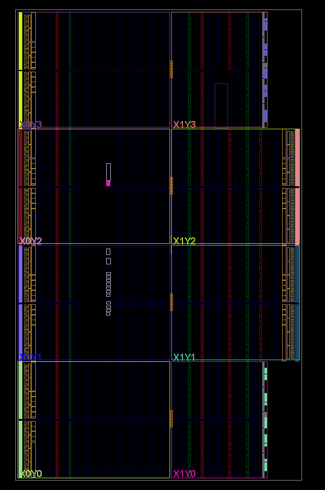

*Post-implementation device view (clock regions X0Y0 to X1Y3, Nexys4 DDR / xc7a100t).*

Achieved $f_{\max}$ and cycles per token at a given `D_MODEL`/sequence length are still open, see [Known Limitations](#known-limitations--whats-next). The LUT/FF breakdown above already shows where the budget goes: the BF16 adder/multiplier trees and per-instance memory dominate, same as the reference FDTD project's adder-chain-heavy profile.

<details>
<summary>Full Vivado utilization report (all sections)</summary>

**1. Slice Logic**

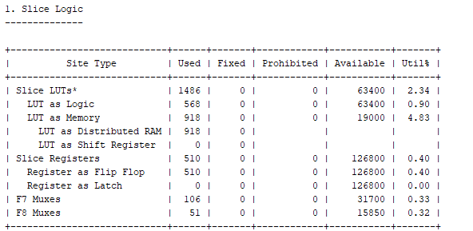

**1.1 Summary of Registers by Type**

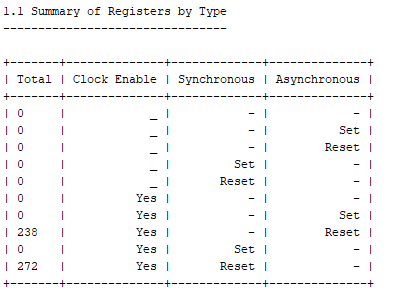

**2. Memory**

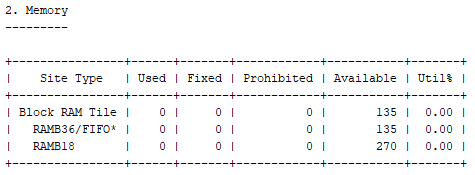

**3. DSP**

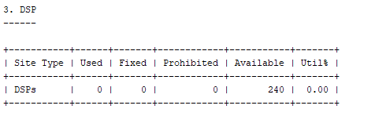

**4. IO and GT Specific**

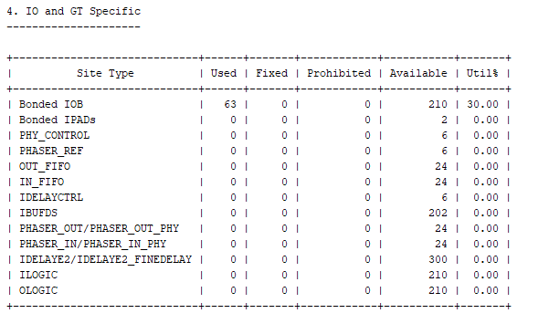

**5. Clocking**

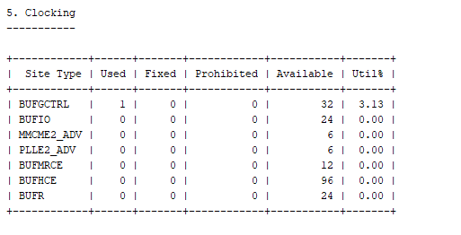

**6. Specific Feature**

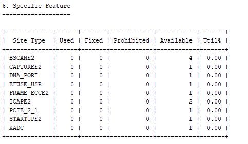

**7. Primitives**

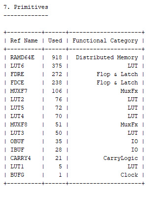

</details>

## Directory Structure

```
rtl/
  compute/     Belinay Güler   : bf16_add, bf16_mul, bf16_comb, bf16_convert, qk_array, qk_pe
  projection/  Can Ertürk      : qkv_proj, rope, gqa_mapper, projection_block (+ generated RoPE ROMs)
  softmax/     Hasan Sancak    : scale_mask, softmax, exp_lut, recip_lut, row_fifo, wrapper (+ LUT hex tables)
  control/     M. Taha Aydemir : axi_stream_if, dbuf, dbuf_read_streamer, uram_*, tx_fifo, mod_a_*
  top.sv       full system integration
tb/            standalone testbenches, one per module/subsystem, plus a shared BF16 to real helper
scripts/       gen_rope_rom.py    : generates the RoPE sin/cos ROM content
architecture.drawio   system data flow plus per-module FSM diagrams (multi-page, draw.io format)
```

## Modules

| File | Owner | Purpose |
|---|---|---|
| `rtl/compute/bf16_add.sv` | Belinay | 2-stage pipelined BF16 adder, 17-bit bus (value + tag) |
| `rtl/compute/bf16_mul.sv` | Belinay | 2-stage pipelined BF16 multiplier, same bus convention |
| `rtl/compute/bf16_comb.sv` | Belinay | FP32 → BF16 (truncate or round) |
| `rtl/compute/bf16_convert.sv` | Belinay | BF16 → FP32 |
| `rtl/compute/qk_array.sv` | Belinay | Time-shared `SIZE×SIZE` systolic PE array (Q·Kᵀ and score·V) |
| `rtl/compute/qk_pe.sv` | Belinay | Single processing element of the array |
| `rtl/projection/qkv_proj.sv` | Can | y = W·x projection, instantiated 4× (Wq/Wk/Wv/Wo) |
| `rtl/projection/rope.sv` | Can | Rotary positional encoding for Q and K |
| `rtl/projection/gqa_mapper.sv` | Can | Query-head → KV-head index translation |
| `rtl/projection/projection_block.sv` | Can | Wraps the above four instances behind 5 fixed ports |
| `rtl/softmax/scale_mask.sv` | Hasan | Per-element scale + causal mask, 3-stage pipeline |
| `rtl/softmax/softmax.sv` | Hasan | Row-wise softmax, accumulate/invert/normalize FSM |
| `rtl/softmax/exp_lut.sv` / `recip_lut.sv` | Hasan | LUT-based exponential and reciprocal |
| `rtl/softmax/row_fifo.sv` | Hasan | Holds a row's exponentials between passes |
| `rtl/softmax/scale_mask_softmax_wrapper.sv` | Hasan | Wraps scale_mask + softmax behind one AXI-Stream pair |
| `rtl/control/axi_stream_if.sv` | Taha | FP32 AXI-Stream to internal BF16 boundary |
| `rtl/control/dbuf.sv` / `dbuf_read_streamer.sv` | Taha | Ping-pong token buffer and its read-side streamer |
| `rtl/control/uram_memory.sv` / `uram_pingpong_controller.sv` | Taha | Q/K/V storage and its ping-pong read/write scheduling |
| `rtl/control/mod_a_input_arbiter.sv` / `mod_a_output_router.sv` | Taha | Arbitration and routing around the shared PE array |
| `rtl/control/mod_a_wrapper.sv` | Taha | Streaming wrapper around `qk_array` (serializer/deserializer) |
| `rtl/control/tx_fifo.sv` | Taha | Output-side FIFO before the AXI-Stream boundary |
| `rtl/top.sv` | Taha, integrated by Can | Full system integration |

## Simulation

Each module has a standalone, self-checking testbench under `tb/`. No full-system simulation is required to validate an individual stage. Every testbench below was actually run to completion in Vivado's XSim, not just written and left unexecuted. Each one prints its own per-check `PASS`/`FAIL` lines plus a final summary, and the waveform captures further down were taken directly from those runs.

| Testbench | Covers | Result |
|---|---|---|
| `tb_bf16_add.sv` | Pipelined BF16 adder, 7 exact-representable operand pairs | PASS 7/7 |
| `tb_bf16_mul.sv` | Pipelined BF16 multiplier, 6 exact-representable operand pairs | PASS 6/6 |
| `tb_gqa_mapper.sv` | Exhaustive head-index mapping, all 8 query heads against 2 KV heads | PASS 8/8 |
| `tb_qkv_proj.sv` | Weight loading and the full $y = Wx$ MAC pipeline, $D_{\text{model}}=4$, $D_{\text{out}}=2$ | PASS 2/2 |
| `tb_rope.sv` | ROM loading, rotate-half pairing, identity rotation at position 0, tolerance check against `$sin`/`$cos` at position 4 | PASS |
| `tb_qk_array.sv` | Shared systolic array through `mod_a_wrapper`, checked against a hand-computed Q$K^T$, SIZE 2, DEPTH 2 | PASS 4/4 |
| `tb_scale_mask_softmax.sv` | Full scale, mask, and softmax chain against the real LUT tables, one uniform row and one causally-masked row | PASS 8/8 |
| `tb_top.sv` | Full `top.sv`, 4 tokens, AXI-Stream in → projection/RoPE → ping-pong URAM → shared array (Q·K$^T$ pass) → scale/softmax, against a bit-exact golden model (`bf16_bitexact_utils.svh`) built from the same RTL LUT/ROM files | Completes, no deadlock/timeout (16/16 `c_v` pulses); values not yet bit-matched, see [Known Limitations](#known-limitations--whats-next) |

<details>
<summary>Waveforms from each testbench run</summary>

**`tb_bf16_add.sv`**

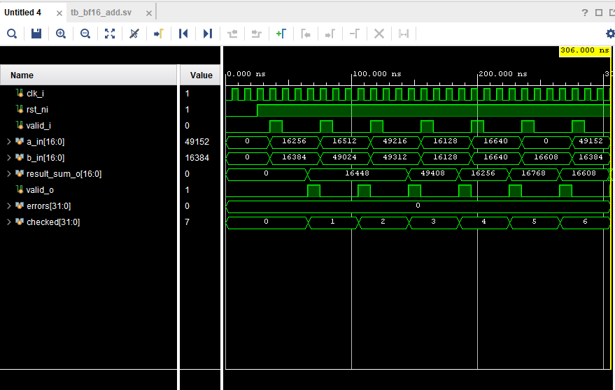

*Seven additions stream through `a_in`/`b_in` back to back, `valid_o` pulsing once per result with the pipeline latency visible between each `valid_i` and its matching `valid_o`. `checked` reaches 7 with `errors` at 0.*

**`tb_bf16_mul.sv`**

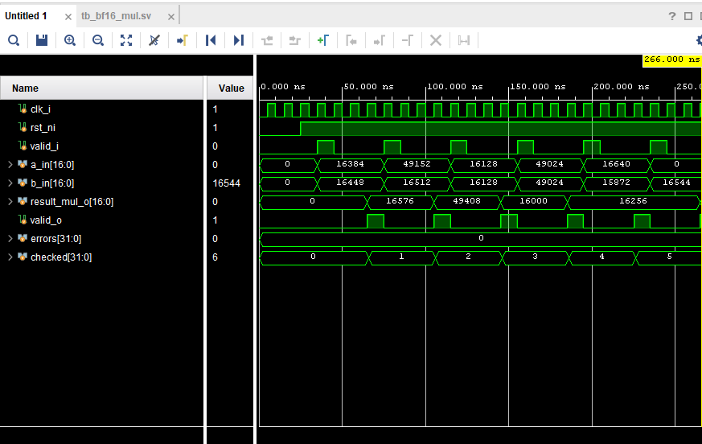

*Same pipelined structure as the adder testbench, six multiplications this time, including a negative operand pair and a multiply by zero. `checked` reaches 6, `errors` stays 0.*

**`tb_gqa_mapper.sv`**

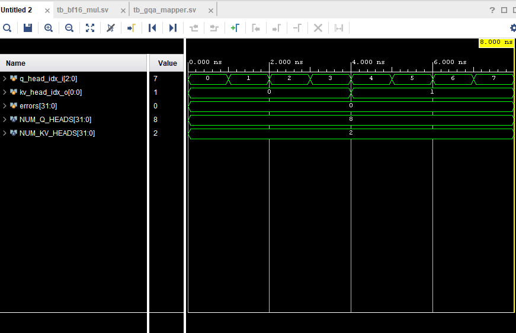

*Combinational, so there is no clock latency to see. `q_head_idx_i` sweeps all 8 query heads while `kv_head_idx_o` steps through the expected `NUM_Q_HEADS`/`NUM_KV_HEADS` groups of 4, `errors` at 0 across the full sweep.*

**`tb_qkv_proj.sv`**

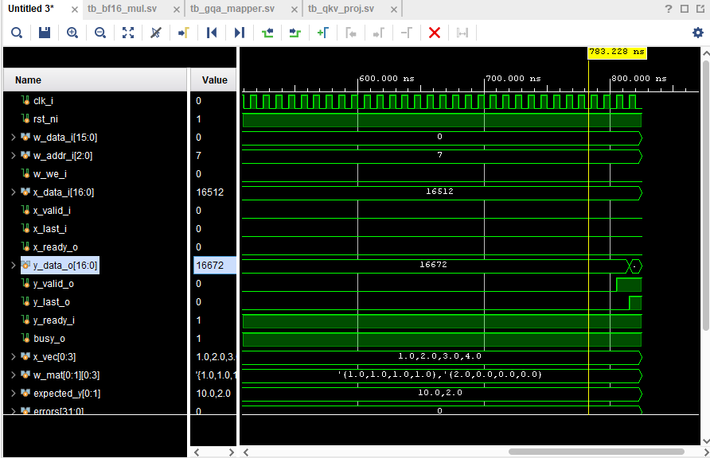

*Weights load first over `w_data_i`/`w_addr_i`, then the token vector $x = [1, 2, 3, 4]$ streams in one element per cycle through `x_data_i`. `y_data_o` produces `10.0` then `2.0`, matching `expected_y`, with `busy_o` high for the whole compute.*

**`tb_rope.sv`**

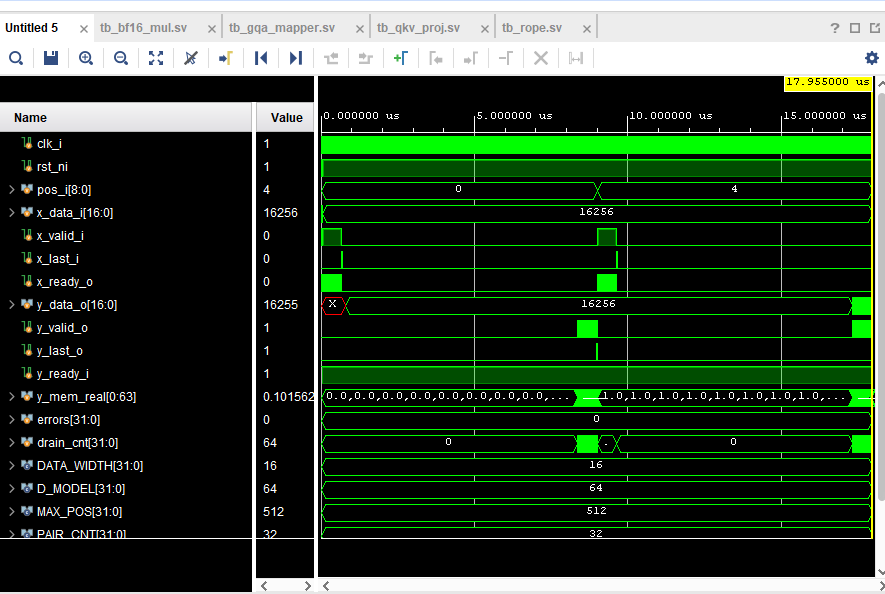

*Two checks in one run. Position 0 first, where every rotation is the identity ($\theta = 0$), then position 4, where `y_mem_real` is checked against `$cos(4.0)` and `$sin(4.0)` within a bf16 truncation tolerance. `errors` stays 0 through both.*

**`tb_qk_array.sv`**

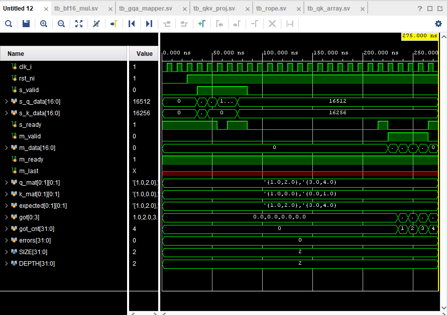

*$Q = \begin{bmatrix}1 & 2\\3 & 4\end{bmatrix}$ against an identity $K$, so the expected result is $Q$ itself. `got` fills in as `[1.0, 2.0, 3.0, 4.0]` in row-major order, `got_cnt` reaching 4 with `errors` at 0. This is the testbench that caught the real `qk_array.sv` and `mod_a_wrapper.sv` bugs described in [Integration](#integration).*

**`tb_scale_mask_softmax.sv`**

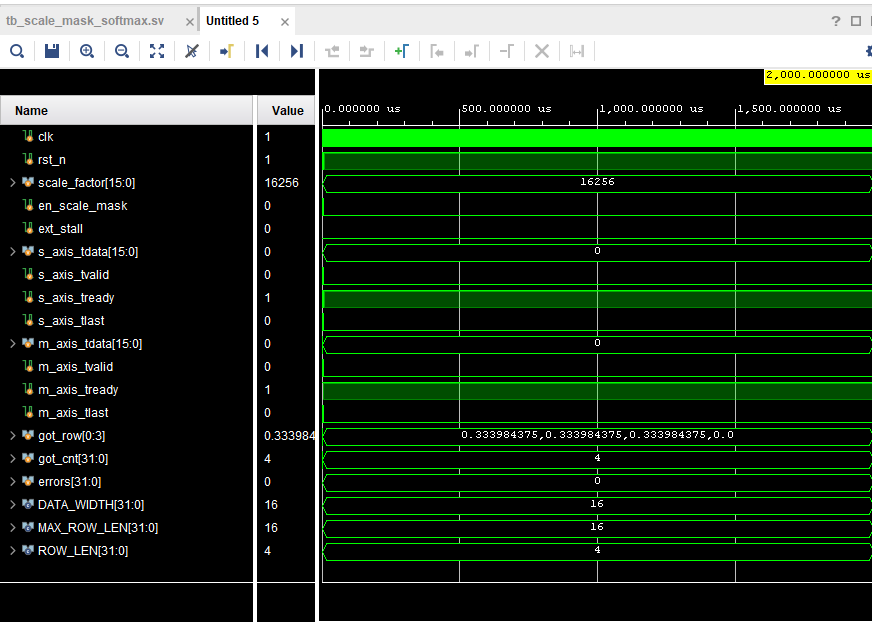

*Full 2 ms simulation window, both test rows already complete by the time this capture was taken. `got_row = [0.333984, 0.333984, 0.333984, 0.0]`, the causally-masked test case: three unmasked elements normalize to $\approx 1/3$ each and the masked fourth element correctly collapses to `0.0`. `errors` at 0.*

</details>

Run with Vivado's simulator from the repo root (paths in the RTL are relative to repo root, see the note below):

```
cd tb
xvlog -sv -f filelist_rtl.f tb_bf16_add.sv
xelab tb_bf16_add -s tb_bf16_add_sim
xsim tb_bf16_add_sim -runall
```

Repeat with the other `tb_*.sv` files. `rope.sv` and `scale_mask_softmax_wrapper.sv` load `.mem`/`.hex` files with paths relative to the repo root (`rtl/projection/rope_*_rom.mem`, `rtl/softmax/*_table.hex`). If Vivado's GUI simulation runs from a different working directory, either point `xsim.simulate.runtime` at the repo root or copy those four files into the simulation run directory.

## Physical Interpretation

Every wire in this design corresponds to something concrete:

- **The 17th bit on every internal bus** isn't part of the number. It is a label saying which logical operation produced this value, so the one shared PE array and the one shared adder/multiplier can serve two different consumers without their results getting crossed.
- **`valid`/`ready` on every boundary** is a literal, physical backpressure signal: nothing moves unless both sides agree, which is what lets a slow softmax stage stall a fast projection stage without losing data.
- **Ping-pong buffers** are two independent memories with a single-bit selector. While hardware writes into one, hardware reads from the other, and they swap roles when a vector finishes.
- **The systolic array's "output-stationary" phase** is the literal moment `SIZE × SIZE` partial sums, one per PE, all become valid at once. That is the hardware equivalent of finishing an entire tile of the Q·Kᵀ matrix in a single parallel step, after `DEPTH` serial cycles of accumulation.

## Real-World Applications

- **Edge LLM inference:** a fixed-function attention block that never leaves an idle GPU running, for always-on or power-constrained assistants.
- **Prefill/decode acceleration in a larger SoC:** as one accelerator tile among several, offloading the attention block specifically while a CPU/DSP handles everything else.
- **Teaching hardware-software co-design:** the same self-attention formula every ML course teaches, but with every stage forced to justify its own logic, latency, and memory footprint.

## Known Limitations / What's Next

Honest status, not a marketing list:

- **GQA head addressing is not wired end to end.** `gqa_mapper` produces a correct KV-head index, but the current URAM controller has no per-head addressing concept yet. The integrated design currently exercises a single head/KV-group path.
- **RoPE ROM content now exists** (`scripts/gen_rope_rom.py`, base-10000 frequency formula) but has not been cross-checked against a Python/NumPy golden model across many positions. Only two positions have been spot-checked in `tb_rope.sv`.
- **`en_scale_mask` is a per-element signal, not a static enable.** It must be driven per data element by real causal-mask logic. Tying it to a constant will mask an entire row.
- **No weight-loading lock or handshake yet.** Nothing currently prevents a weight write from racing a computation using that same weight.
- **Score·V tag alignment is a flagged assumption**, not a confirmed team decision. See the comment in `mod_a_input_arbiter.sv`.
- **Softmax normalizes the whole 4×4 score matrix as one 16-element row instead of four independent 4-element rows.** `mod_a_wrapper.sv`'s `m_last` (which tells softmax "this is the last element, start normalizing") only fires once per matrix (`row_cnt==SIZE-1 && col_cnt==SIZE-1`), not once per row. Changing it to fire per row (`col_cnt==SIZE-1`) makes row 0 normalize correctly but then deadlocks on row 1 (scale_mask's single-element `pipe_busy` slot never frees up), so that change was reverted and the root cause of the row-1 deadlock is still open. Net effect right now: the pipeline runs end to end with no timeout, but softmax's output values don't match the golden model row-by-row (row sums come out ~4× too large).
- **The score·V pass and the output projection (`Wo`) are still untested end to end.** `tb_top.sv` only exercises AXI-Stream in → projection/RoPE → URAM → Q·Kᵀ → scale/softmax. Feeding softmax's weights back into Module A for score·V, and the final `qkv_proj`(Wo)/`tx_fifo` stage, still only have their original module-level testbenches, not a full-chip one.
- **Timing closure and $f_{\max}$ are not measured yet.** See [Performance Analysis](#performance-analysis) for the resource utilization numbers that are already available.

## References

[1] A. Vaswani et al., "Attention Is All You Need," in *Proc. NeurIPS*, 2017.
[2] J. Su et al., "RoFormer: Enhanced Transformer with Rotary Position Embedding," arXiv:2104.09864, 2021.
[3] J. Ainslie et al., "GQA: Training Generalized Multi-Query Transformer Models from Multi-Head Checkpoints," arXiv:2305.13245, 2023.
[4] Google Brain, "bfloat16: The secret to high performance on Cloud TPUs," Google Cloud Blog, 2019.
